# Redesign Database Sistem Manajemen Gym

## Analisis Masalah Database Saat Ini

Setelah membaca seluruh model, migration, dan route, saya menemukan **banyak masalah serius** pada desain database yang ada:

---

### 🔴 Masalah Kritis

#### 1. Tabel `gym_members` Jadi "God Table" (Terlalu Banyak Tanggung Jawab)
Tabel ini mencampur **member tetap** dan **daily pass/tamu** dalam satu tabel dengan 20+ kolom:
- Kolom `member_status`, `status` — dua kolom yang fungsinya sama (duplikat)
- Kolom `package_status`, `guest_visit_type` — hanya relevan untuk daily pass, NULL untuk member
- Kolom `payment_method`, `payment_amount`, `visit_date` — data pembayaran tamu yang seharusnya di tabel transaksi
- Kolom `password` ada di migration lama tapi auth sekarang lewat tabel `users` → kolom mubazir

#### 2. Duplikasi Tabel Daily Guest
- Ada `daily_guests` (tabel terpisah) DAN data daily pass di `gym_members` (via `member_status = 'daily_pass'`).
- Dua tempat untuk menyimpan data yang sama = **data tidak konsisten**.

#### 3. Tabel `member_histories` Menduplikasi Data dari Tabel Lain
- Tabel ini meng-copy data check-in dari `gym_checkins` dan transaksi dari `cashier_transactions`.
- Ini melanggar prinsip **Single Source of Truth** — data tersimpan di 2 tempat.
- Jika data di `gym_checkins` berubah, `member_histories` tidak ikut ter-update.

#### 4. Tabel `membership_plans` Tidak Dipakai
- Ada migration `create_membership_plans_table` tapi **tidak ada Model** untuk tabel ini.
- Paket membership di-hardcode sebagai string di `gym_members.membership_plan` (contoh: `'membership_1_bulan'`).

#### 5. Kolom `category` (string) DAN `category_id` (FK) pada Tabel `products`
- Migration menambahkan `category_id` tapi kolom lama `category` (string) tidak dihapus.
- Kode report (`reports.php`) masih memakai `where('category', 'vitamin')` — mixing dua pendekatan.

#### 6. Tidak Ada Foreign Key Konsisten
- `membership_renewal_requests.gym_member_id` tidak punya FK constraint (plain `unsignedBigInteger`).
- `profile_photo_change_requests.gym_member_id` juga tanpa FK constraint.
- `cashier_transactions` tidak punya FK ke `gym_members`.

#### 7. Tabel `cashier_transactions` Terlalu Generik
- Mencampur pembayaran membership, daily pass, penjualan produk, dan "other" dalam satu tabel.
- Kolom `transaction_group` dipakai untuk membedakan, tapi ini membuat query dan validasi rumit.

#### 8. Duplikasi Migration
- `2024_05_07` dan `2026_04_01` sama-sama `create_gym_members_table` → konflik.
- `2026_04_21` dan `2026_05_10` sama-sama `add_profile_photo_path_to_gym_members_table` → duplikat.
- `2026_04_07_221000` dan `2026_05_10_124055` sama-sama `create_cashier_transactions_table` → duplikat.

---

## Proposed Changes — Desain Database Baru

Berikut adalah skema database yang **bersih, ternormalisasi, dan efisien**:

```mermaid
erDiagram
    users ||--o| members : "has one"
    users {
        bigint id PK
        string name
        string login UK "nullable, untuk admin/kasir"
        string email UK "nullable"
        enum role "admin, master_admin, cashier, member"
        string password
        timestamp email_verified_at
        string remember_token
        timestamps created_at
        timestamps updated_at
    }

    members {
        bigint id PK
        bigint user_id FK "nullable, UK"
        string full_name
        string email UK "nullable"
        string phone "nullable"
        string checkin_code UK "nullable"
        string profile_photo_path "nullable"
        tinyint profile_photo_change_count "default 0"
        date joined_at "nullable"
        date expires_at "nullable"
        timestamp last_membership_reminder_at "nullable"
        text notes "nullable"
        timestamps created_at
        timestamps updated_at
    }

    membership_plans {
        bigint id PK
        string name UK "Bulanan, 3 Bulan, 6 Bulan, Tahunan"
        int duration_months
        int price
        text description "nullable"
        boolean is_active "default true"
        timestamps created_at
        timestamps updated_at
    }

    membership_subscriptions ||--|| members : "belongs to"
    membership_subscriptions ||--|| membership_plans : "uses plan"
    membership_subscriptions {
        bigint id PK
        bigint member_id FK
        bigint membership_plan_id FK
        date start_date
        date end_date
        int amount_paid
        string payment_method "cash, qris, transfer"
        string status "active, expired, cancelled"
        timestamps created_at
        timestamps updated_at
    }

    membership_renewal_requests ||--|| members : "belongs to"
    membership_renewal_requests {
        bigint id PK
        bigint member_id FK
        bigint user_id FK "nullable"
        bigint membership_plan_id FK
        int amount
        string payment_method
        string payment_proof_path "nullable"
        enum status "pending, approved, rejected"
        timestamp requested_at "nullable"
        timestamp reviewed_at "nullable"
        bigint reviewed_by "nullable"
        timestamps created_at
        timestamps updated_at
    }

    daily_guests {
        bigint id PK
        string full_name
        string phone "nullable"
        string visit_type "reguler, event, dll"
        timestamp visit_at
        timestamps created_at
        timestamps updated_at
    }

    checkins ||--o| members : "member check-in"
    checkins ||--o| daily_guests : "guest check-in"
    checkins {
        bigint id PK
        bigint member_id FK "nullable"
        bigint daily_guest_id FK "nullable"
        timestamp checked_in_at
        string checkin_method "admin, qr_code, self_service"
        enum verification_status "pending, verified, rejected"
        string submitted_name "nullable"
        string submitted_phone "nullable"
        timestamp verified_at "nullable"
        bigint verified_by FK "nullable"
        text notes "nullable"
        timestamps created_at
        timestamps updated_at
    }

    categories {
        bigint id PK
        string name UK
        text description "nullable"
        timestamps created_at
        timestamps updated_at
    }

    products ||--|| categories : "belongs to"
    products {
        bigint id PK
        bigint category_id FK "nullable"
        string name
        string brand "nullable"
        string sku UK "nullable"
        int price
        int stock "default 0"
        string unit "nullable, pcs/botol/sachet"
        text description "nullable"
        boolean is_active "default true"
        timestamps created_at
        timestamps updated_at
    }

    transactions {
        bigint id PK
        string invoice UK
        bigint member_id FK "nullable"
        bigint daily_guest_id FK "nullable"
        bigint cashier_user_id FK "nullable"
        enum type "membership_payment, daily_pass, product_sale, expense, other"
        string description "nullable"
        int amount
        int paid_amount "nullable"
        int change_amount "nullable"
        string payment_method "cash, qris, transfer"
        enum payment_status "pending, verified, cancelled"
        timestamp transaction_at
        text notes "nullable"
        timestamps created_at
        timestamps updated_at
    }

    transaction_items ||--|| transactions : "belongs to"
    transaction_items ||--o| products : "optional product"
    transaction_items {
        bigint id PK
        bigint transaction_id FK
        bigint product_id FK "nullable"
        string item_name
        int quantity "default 1"
        int unit_price
        int subtotal
        timestamps created_at
        timestamps updated_at
    }

    expense_records {
        bigint id PK
        bigint category_id FK "nullable, reuse categories"
        string title
        int amount
        string payment_method "cash, qris, transfer"
        date expense_date
        text notes "nullable"
        timestamps created_at
        timestamps updated_at
    }

    announcements {
        bigint id PK
        string title
        text body
        enum status "draft, published, archived"
        timestamp publish_at "nullable"
        timestamp archived_at "nullable"
        timestamps created_at
        timestamps updated_at
    }

    member_feedbacks ||--o| members : "from member"
    member_feedbacks {
        bigint id PK
        bigint user_id FK "nullable"
        bigint member_id FK "nullable"
        string name
        string email "nullable"
        string subject
        text message
        timestamp read_at "nullable"
        timestamps created_at
        timestamps updated_at
    }

    profile_photo_change_requests ||--|| members : "belongs to"
    profile_photo_change_requests {
        bigint id PK
        bigint user_id FK "nullable"
        bigint member_id FK
        string requested_photo_path
        enum status "pending, approved, rejected"
        timestamp reviewed_at "nullable"
        bigint reviewed_by FK "nullable"
        timestamps created_at
        timestamps updated_at
    }
```



---

## Perbandingan Database Lama vs Baru

| Aspek | Database Lama ❌ | Database Baru ✅ |
|---|---|---|
| **Tabel `gym_members`** | 20+ kolom, campur member & daily pass | Tabel `members` khusus member saja, bersih |
| **Daily pass** | Data di `gym_members` DAN `daily_guests` (duplikat) | Hanya di `daily_guests` |
| **Membership plan** | Hardcode string (`'membership_1_bulan'`) | Tabel `membership_plans` + `membership_subscriptions` (dinamis) |
| **Riwayat membership** | Tidak tercatat | `membership_subscriptions` mencatat semua histori langganan |
| **Transaksi** | Satu tabel campur semua jenis + kolom membengkak | `transactions` + `transaction_items` (normalisasi) |
| **History member** | Tabel `member_histories` duplikasi data | **Dihapus** — query langsung dari `checkins` dan `transactions` |
| **Produk category** | `category` (string) + `category_id` (FK) duplikat | Hanya `category_id` (FK) |
| **Foreign keys** | Banyak yang hilang | Semua relasi punya FK constraint |
| **Total tabel** | ~14 tabel (banyak tidak terpakai/duplikat) | **13 tabel**, semuanya terpakai dan bersih |

---

## Detail Perubahan Per Komponen

### 1. Tabel `members` (rename dari `gym_members`)
- **Hapus** kolom: `member_status`, `status`, `package_status`, `guest_visit_type`, `can_check_in`, `payment_method`, `payment_amount`, `visit_date`, `password`, `membership_plan`
- **Pertahankan** kolom: `full_name`, `email`, `phone`, `user_id`, `checkin_code`, `profile_photo_path`, `profile_photo_change_count`, `joined_at`, `expires_at`, `last_membership_reminder_at`, `notes`
- Tabel ini **hanya untuk member tetap**

### 2. Tabel `membership_plans` (baru, tabel master)
- Menyimpan paket membership yang tersedia (Bulanan, 3 Bulan, dll.)
- Admin bisa CRUD paket lewat panel, bukan hardcode

### 3. Tabel `membership_subscriptions` (baru)
- Mencatat **setiap pembelian/perpanjangan** membership
- Menggantikan fungsi kolom `expires_at` yang sebelumnya di-overwrite setiap perpanjangan

### 4. Tabel `daily_guests` (tetap, satu-satunya tempat data tamu)
- Tambah kolom `visit_type` untuk jenis kunjungan
- **Hapus** data daily pass dari tabel `gym_members`

### 5. Tabel `checkins` (rename dari `gym_checkins`)
- Tambah `daily_guest_id` FK agar tamu harian juga bisa check-in
- `member_id` nullable (untuk member)
- `verified_by` ubah ke FK `bigint` (bukan string)

### 6. Tabel `transactions` (rename dari `cashier_transactions`)
- Tambah `daily_guest_id` dan `cashier_user_id` FK
- Tambah kolom `type` enum yang jelas
- Hapus `transaction_group` dan `receipt_status` yang ambigu

### 7. Tabel `transaction_items` (baru)
- Untuk **penjualan produk**: satu transaksi bisa punya banyak item
- Normalisasi dari kolom `product_id`, `quantity` yang sebelumnya langsung di `cashier_transactions`

### 8. Tabel `member_histories` → **DIHAPUS**
- Tidak perlu menduplikasi data yang sudah ada di `checkins` dan `transactions`
- Query riwayat member cukup join dari tabel aslinya

### 9. Tabel `products`
- **Hapus** kolom `category` (string lama) — pakai `category_id` saja

---

## Open Questions

> [!IMPORTANT]
> **Apakah kamu mau saya langsung implementasikan redesign ini ke project Laravel-mu (buat migration baru, update model, dan update route)?** Ini akan menjadi perubahan besar karena hampir seluruh sistem harus disesuaikan.

> [!WARNING]
> **Jika sudah ada data production** di database lama, kita perlu migration data (data migration) agar tidak hilang. Apakah saat ini database masih kosong/development saja?

> [!NOTE]
> Beberapa pertimbangan tambahan:
> 1. Apakah kamu ingin menambahkan fitur **inventory tracking** (stok masuk/keluar) di tabel produk?
> 2. Apakah perlu tabel **audit_logs** untuk mencatat siapa yang melakukan perubahan data?
> 3. Apakah ada rencana menambahkan fitur lain yang perlu diakomodasi di database?

---

## Verification Plan

### Automated Tests
```bash
php artisan migrate:fresh --seed
php artisan test
```

### Manual Verification
- Pastikan semua fitur admin, kasir, dan member tetap berfungsi
- Cek laporan keuangan masih menghasilkan data yang benar
- Verifikasi check-in flow (QR, manual, self-service) tetap bekerja
