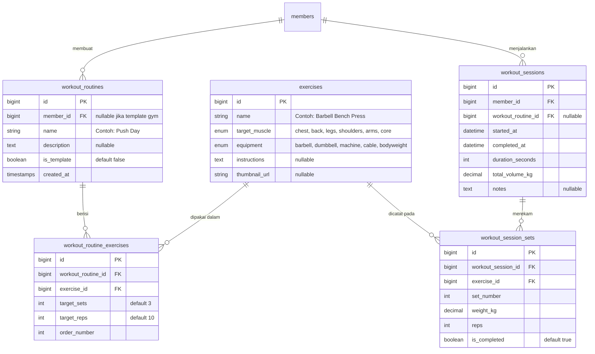

# Rencana Pengembangan Aplikasi Mobile Member Arena Fitness
**Framework:** Flutter (Multiplatform: Android & iOS)  
**Backend:** Laravel 12 RESTful API (Sanctum)  
**Modul Utama:** Presensi QR Code, Membership & Midtrans, serta **Workout Routine & Repetition Tracker**  
**Dokumen:** `mobile_plan1.md`  
**Peruntukan:** Rencana Teknis & Proposal Pengembangan (Tugas Akhir / Skripsi D-III MI)

---

## 1. Pendahuluan & Latar Belakang

Sistem Informasi Manajemen Gym **Arena Fitness** saat ini telah memiliki portal web untuk operasional kasir, admin, dan portal member. Berdasarkan arahan dosen pembimbing serta kebutuhan peningkatan nilai fungsional aplikasi member, sistem dikembangkan menjadi **aplikasi mobile multiplatform (Android & iOS)** dengan 3 pilar utama:
1. **Layanan Mandiri Keanggotaan (*Member Self-Service*):** Presensi digital QR Code mandiri dan pembelian/perpanjangan paket membership online via **Midtrans Payment Gateway**.
2. **Pelacak & Penjadwal Latihan (*Workout Routine & Repetition Tracker*):** Member dapat membuat jadwal program latihan (*Routines*), memilih template latihan gym, serta mencatat beban (kg) dan repetisi (*sets/reps*) secara langsung saat berolahraga di gym (mengadopsi antarmuka populer seperti aplikasi Hevy / Strong).
3. **Analisis Progres Latihan:** Menampilkan grafik konsistensi dan volume latihan terintegrasi dengan kehadiran di gym.

---

## 2. Spesifikasi Teknologi (*Tech Stack*)

| Komponen | Pilihan Teknologi | Keterangan |
|---|---|---|
| **Mobile Framework** | **Flutter 3.x (Dart 3.x)** | Mendukung *cross-platform* (Android & iOS) dari satu basis kode dengan performa tinggi (60/120 fps). |
| **Backend Framework**| **Laravel 12** | Monolith backend yang diperluas dengan layer **RESTful API**. |
| **Autentikasi API**  | **Laravel Sanctum** | Autentikasi berbasis *Bearer Token* yang aman dan ringan untuk aplikasi mobile. |
| **Database**         | **SQLite / MySQL** | Database terpusat untuk member, transaksi, presensi, master gerakan, routine, dan log repetisi. |
| **Payment Gateway**  | **Midtrans Snap** | Menggunakan In-App WebView terintegrasi untuk pembayaran instan (QRIS, GoPay, Transfer Bank VA). |
| **Penyimpanan Lokal**| **Flutter Secure Storage** | Enkripsi token sesi login di Keychain (iOS) dan Keystore (Android). |
| **State Management** | **Riverpod / Provider** | Manajemen status reaktif untuk keranjang latihan (*active workout session*), timer istirahat, dan data user. |
| **HTTP Client**      | **Dio** | Client HTTP berkemampuan interceptor token dan error handling otomatis. |
| **Desain & Tema**    | **Industrial Brutalist Dark** | Palet warna `#131313`, `#1f1f1f`, aksen merah `#ff5540`, font Oswald & JetBrains Mono. |

---

## 3. Pemetaan Arsitektur Menu & Navigasi Aplikasi

Struktur navigasi bawah (*Bottom Navigation Bar*) disusun intuitif, menempatkan modul **Workout** sebagai menu inti di samping **Home**, **QR Presensi**, **Membership**, dan **Profil**:

```mermaid
graph TD
    Root[Aplikasi Mobile Member Arena Fitness] --> Auth[Modul Autentikasi]
    Root --> MainNav[Bottom Navigation Bar]

    Auth --> A1[1. Login Member]
    Auth --> A2[2. Aktivasi Akun]
    Auth --> A3[3. Lupa Password]

    MainNav --> M1[Tab 1: Home]
    MainNav --> M2[Tab 2: Workout Planner & Tracker]
    MainNav --> M3[Tab 3: QR Presensi - Tombol Tengah]
    MainNav --> M4[Tab 4: Membership & Midtrans]
    MainNav --> M5[Tab 5: Profil & Riwayat]

    M1 --> M1a[Header Profil & Status Badge]
    M1 --> M1b[Kartu Sisa Hari Aktif & Total Check-in]
    M1 --> M1c[Banner Peringatan Kedaluwarsa <= 7 Hari]
    M1 --> M1d[Pengumuman Gym & Info Lokasi 24 Jam]
    M1 --> M1e[Form Kritik & Saran Fasilitas]

    M2 --> M2a[Start Empty Workout - Latihan Bebas]
    M2 --> M2b[New Routine - Buat Jadwal Kustom]
    M2 --> M2c[Explore Routines - Template Program Gym]
    M2 --> M2d[Live Workout Logger: Set, Beban kg, Repetisi]
    M2 --> M2e[Rest Timer Otomatis Antar-Set]
    M2 --> M2f[Ringkasan Volume & Durasi Latihan]

    M3 --> M3a[Kartu Member Digital Eksklusif]
    M3 --> M3b[Render Dinamis QR Code Presensi]
    M3 --> M3c[Panduan Scan Pintu Masuk Gym]

    M4 --> M4a[Status Langganan & Progress Bar]
    M4 --> M4b[Pilihan Paket: 1, 3, 6, 12 Bulan]
    M4 --> M4c[Checkout Midtrans Snap In-App WebView]
    M4 --> M4d[Riwayat Tagihan & Invoice Digital]
    M4 --> M4e[Fitur Batal Transaksi Pending]

    M5 --> M5a[Detail Identitas & Akun]
    M5 --> M5b[Ubah Email & No. WhatsApp]
    M5 --> M5c[Ganti Foto Profil - Kuota Otomatis 3x]
    M5 --> M5d[Grafik Kehadiran & Konsistensi Latihan]
    M5 --> M5e[Logout & Revoke Token]
```

---

## 4. Rincian Modul Baru: Workout Routine & Repetition Tracker

Modul ini dirancang berdasarkan konsep aplikasi pencatat latihan modern (seperti *Hevy / Strong App*):

### 4.1. Layar Utama Workout (*Workout Hub*)
1. **Tombol Aksi Utama: `+ Start Empty Workout`**
   - Member dapat langsung memulai sesi latihan tanpa harus membuat jadwal terlebih dahulu.
   - Member dapat menambahkan latihan secara dinamis di gym (*Add Exercise*).
2. **Kategori `Routines` (Jadwal & Program Latihan):**
   - **`New Routine` (Buat Jadwal Baru):**
     - Member memberi nama program (contoh: *"Senin - Push Day: Dada & Triceps"*).
     - Menambahkan daftar gerakan target (misal: *Bench Press, Incline Dumbbell Press, Triceps Pushdown*).
     - Menentukan target repetisi dan jumlah set bawaan (*default sets & target reps*).
   - **`Explore Routines` (Koleksi Program Latihan):**
     - Template siap pakai yang disediakan oleh Arena Fitness (contoh: *"Program Pemula 3 Hari"*, *"Push-Pull-Legs (PPL)"*, *"Upper-Lower Split"*, *"Fat Loss Bodyweight"*).
3. **Bagian `Recent Workouts`:**
   - Menampilkan catatan riwayat latihan terakhir (nama routine, tanggal, durasi menit, total repetisi, dan beban total *volume kg*).

### 4.2. Layar Sesi Latihan Berjalan (*Live Workout Logger*)
Saat member menekan *Start Workout*, aplikasi masuk ke mode latihan aktif:
- **Tabel Pencatatan Real-Time Per Gerakan:**
  | Set | Beban Sebelumnya | Beban Saat Ini (kg) | Repetisi (Reps) | Selesai |
  |:---:|:----------------:|:-------------------:|:---------------:|:-------:|
  | 1   | 40 kg × 10 reps  | `[ 42.5 ]` kg       | `[ 10 ]`        | `[ ✓ ]` |
  | 2   | 40 kg × 10 reps  | `[ 42.5 ]` kg       | `[ 8 ]`         | `[ ✓ ]` |
  | 3   | 40 kg × 8 reps   | `[ 40.0 ]` kg       | `[ 10 ]`        | `[ ✓ ]` |
- **Rest Timer Otomatis:**
  - Begitu tombol centang `[ ✓ ]` diklik, muncul *countdown timer* waktu istirahat (default 60 / 90 / 120 detik) dengan getaran (*haptic feedback*) saat waktu istirahat habis.
- **Tambah / Hapus Set:**
  - Tombol `+ Add Set` untuk menambah baris repetisi baru.
- **Selesaikan Latihan (*Finish Workout*):**
  - Menghitung total durasi latihan, jumlah set sukses, dan total volume beban ($kg \times reps$).
  - Data tersimpan otomatis ke database backend dan menambah progres riwayat latihan member.

---

## 5. Perancangan Skema Database Modul Workout

Untuk mendukung fitur jadwal dan pencatatan repetisi latihan ini, skema database sistem diperluas dengan tabel-tabel berikut:

---

## 6. Daftar Kontrak RESTful API (Backend Laravel)

Penambahan endpoint khusus untuk modul *Workout Routine & Repetition Tracker*:

| No | Method | Endpoint | Fungsi | Status Auth |
|:--:|:------:|:---------|:-------|:-----------:|
| 1 | `GET` | `/api/member/exercises` | Mengambil master daftar gerakan latihan & filter otot | `auth:sanctum` |
| 2 | `GET` | `/api/member/routines` | Mengambil daftar routine pribadi & template dari gym | `auth:sanctum` |
| 3 | `POST` | `/api/member/routines` | Membuat program/jadwal latihan baru | `auth:sanctum` |
| 4 | `GET` | `/api/member/routines/{id}` | Mengambil detail gerakan dalam suatu routine | `auth:sanctum` |
| 5 | `DELETE`| `/api/member/routines/{id}`| Menghapus routine kustom member | `auth:sanctum` |
| 6 | `POST` | `/api/member/workouts/start`| Memulai sesi latihan baru (kosong / dari routine) | `auth:sanctum` |
| 7 | `POST` | `/api/member/workouts/log-set` | Menyimpan log per set (beban kg dan repetisi) | `auth:sanctum` |
| 8 | `POST` | `/api/member/workouts/finish` | Menyelesaikan sesi workout & kalkulasi volume | `auth:sanctum` |
| 9 | `GET` | `/api/member/workouts/history`| Riwayat sesi latihan lampau beserta rincian repetisi | `auth:sanctum` |

*(Endpoint autentikasi, dashboard, presensi QR, membership, dan profil tetap berjalan sesuai kontrak pada Bab 8 dokumen sebelumnya).*

---

## 7. Usulan Judul Laporan Akhir (Tugas Akhir / Skripsi)

Dengan bergabungnya fitur **Payment Gateway (Midtrans)** dan **Workout Routine & Repetition Tracker**, topik tugas akhir Anda menjadi sangat komprehensif, memiliki bobot akademik tinggi, dan memenuhi standar proyek D-III Manajemen Informatika / Teknik Informatika:

### 🏆 Rekomendasi Utama (Paling Seimbang & Nilai Jual Tinggi):
> **"Rancang Bangun Aplikasi Mobile Member Gym dengan Fitur Workout Tracker dan Pembayaran Online Menggunakan Midtrans (Studi Kasus: Arena Fitness Kediri)"**

### Opsi 2 (Fokus Sistem Terintegrasi Multiplatform):
> **"Pengembangan Sistem Informasi Manajemen Gym Berbasis Web dan Mobile Terintegrasi Payment Gateway dan Modul Penjadwalan Latihan pada Arena Fitness"**

### Opsi 3 (Fokus Rekayasa Perangkat Lunak Mobile & Pelayanan Member):
> **"Penerapan Framework Flutter pada Sistem Informasi Keanggotaan Gym dengan Fitur Presensi QR Code, Workout Logger, dan Transaksi Midtrans di Arena Fitness Kediri"**

---

## 8. Rencana Pengujian (*Verification Plan*)

1. **Uji Validasi Log Latihan:**
   - Memastikan pencatatan set, beban, dan repetisi tersimpan akurat ke database secara real-time.
   - Memastikan timer istirahat berjalan lancar di latar depan maupun saat layar terkunci.
   - Memastikan kalkulasi total volume beban ($kg \times repetisi$) tepat.
2. **Uji Fungsional Presensi QR Code:**
   - Memastikan QR Code presensi cepat terbaca pada reader scanner di pintu gym.
3. **Uji Transaksi Pembayaran:**
   - Simulasi pembayaran paket membership via Midtrans Sandbox -> Webhook diterima -> Masa aktif member otomatis bertambah.
4. **Uji Kompatibilitas Multiplatform:**
   - Pengujian instalasi APK pada perangkat fisik Android dan kesiapan build iOS (Runner / Simulator).

---
*Dokumen diperbarui otomatis dengan penambahan modul Workout Routine & Repetition Tracker.*
